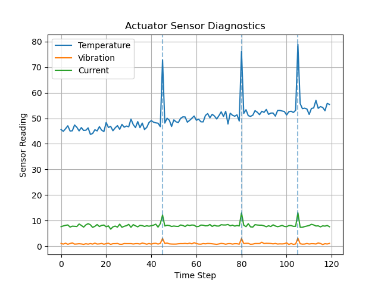

# ARC Sensor Diagnostics

ARC Sensor Diagnostics is the predictive maintenance and sensor-monitoring module for the ARC robotics stack.

This repository focuses on simulated actuator sensor data, anomaly detection, early fault indicators, and diagnostic logic for robotic and mechatronic systems.

## Project Goals

- Simulate actuator sensor data
- Track temperature, vibration, and current readings
- Detect abnormal sensor behavior
- Identify early fault indicators
- Build a foundation for predictive maintenance in robotic systems

## Why This Project Matters

Robotic and mechatronic systems rely on sensors to monitor health and performance. Abnormal vibration, overheating, or unusual current draw can indicate mechanical stress, actuator wear, or early failure.

This project explores how sensor diagnostics can support safer and more reliable robotics systems.

## Planned Features

- Simulated actuator sensor data
- Temperature, vibration, and current monitoring
- Rule-based anomaly detection
- Diagnostic reporting
- Visualization of sensor trends
- Future machine learning-based fault prediction

## Tech Stack

- Python
- NumPy
- Matplotlib
- Sensor diagnostics concepts
- Predictive maintenance concepts

## Current Status

Initial repository created.

Next step: add simulated actuator sensor diagnostics.

## How to Run

Install dependencies:

    pip install -r requirements.txt

Run the sensor diagnostics simulation:

    PYTHONPATH=. python3 examples/run_sensor_diagnostics.py

## Demo Output

### Actuator Sensor Diagnostics

This simulation generates actuator sensor data for temperature, vibration, and current, then detects abnormal readings that may indicate early fault conditions.

## Current Features

- Simulated actuator sensor data
- Temperature monitoring
- Vibration monitoring
- Current monitoring
- Rule-based anomaly detection
- Diagnostic reporting
- Sensor trend visualization using Matplotlib
